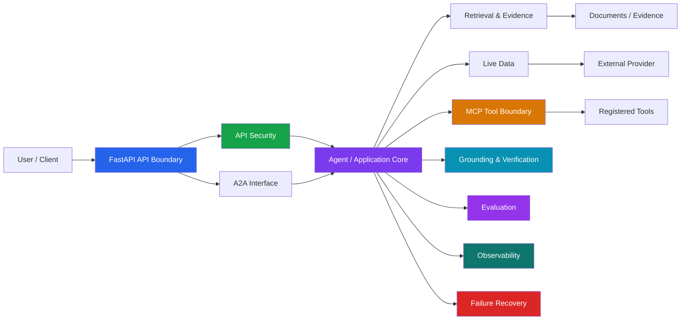
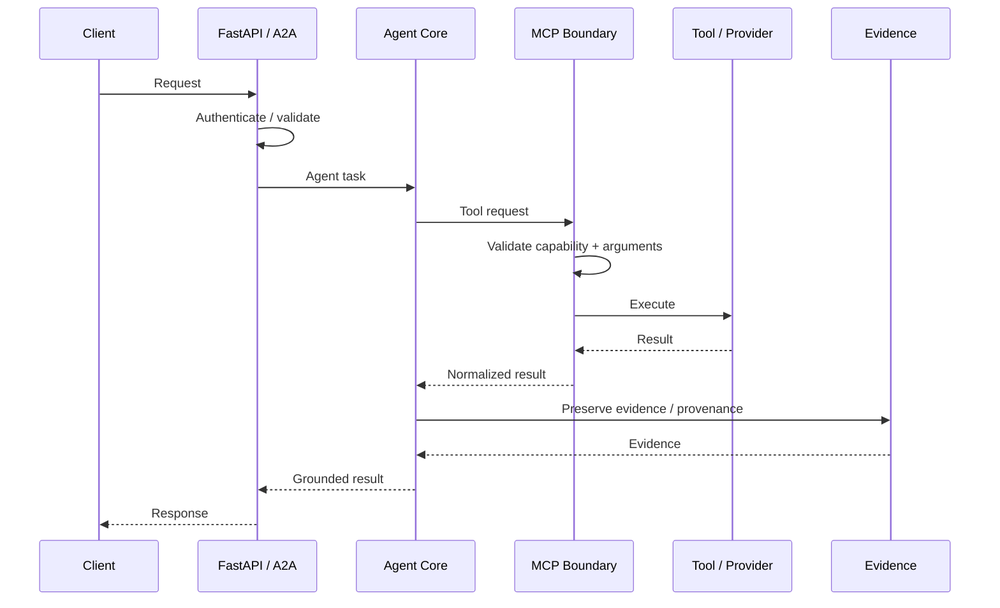
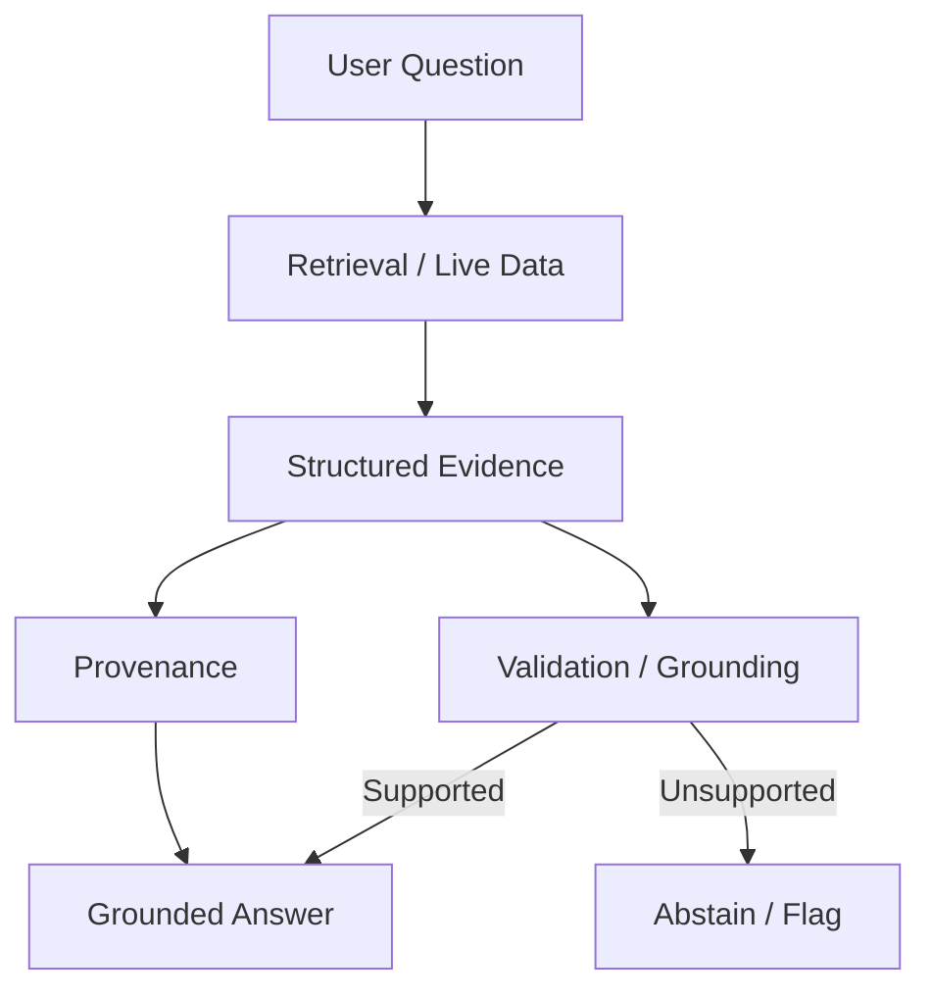
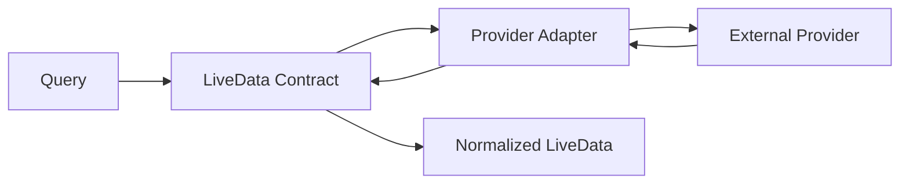
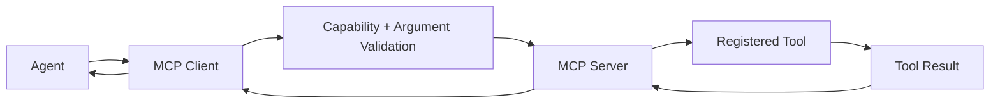
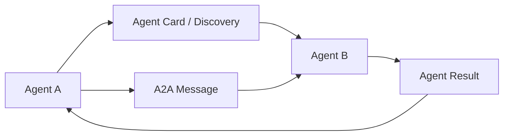
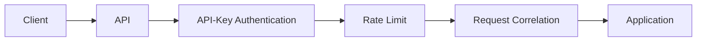
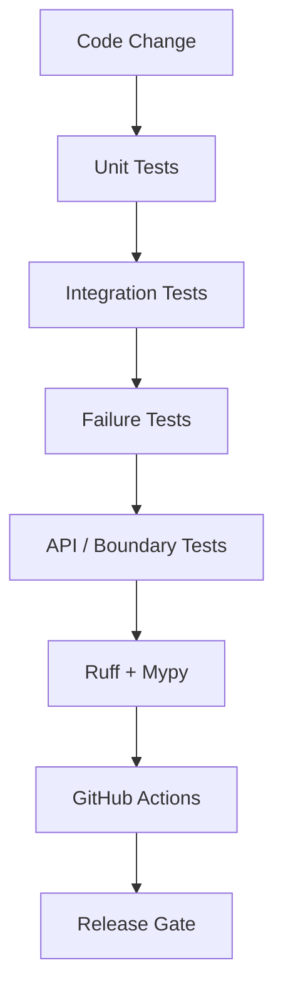

# Enterprise Agentic Intelligence Platform

<p align="center">
  <strong>Production-style • Provider-neutral • Evidence-first • Agentic AI</strong>
</p>

<p align="center">
  
  
  
  
  
  
  
</p>

<p align="center">
  <a href="#architecture">Architecture</a> •
  <a href="#capabilities">Capabilities</a> •
  <a href="#quick-start">Quick Start</a> •
  <a href="#security">Security</a> •
  <a href="#testing--quality">Testing</a> •
  <a href="#interview-guide">Interview Guide</a>
</p>

---

## 🎯 What This Project Is

The **Enterprise Agentic Intelligence Platform** is a provider-neutral, evidence-first enterprise GenAI platform designed to demonstrate how agentic systems can be engineered as reliable software rather than treated as a collection of model prompts.

The platform brings together deterministic domain contracts, retrieval and evidence handling, grounding and evaluation, live external data, MCP tool integration, A2A agent interoperability, failure recovery, observability, API security, reproducible packaging, and automated quality gates.

> **Use an LLM where reasoning is valuable; use deterministic software everywhere a deterministic contract is sufficient.**

---

## 🏆 Current Release Status

| Gate | Status |
|---|---|
| Core platform | 🟢 Complete |
| Retrieval / evidence | 🟢 Complete |
| Live data | 🟢 Complete |
| MCP integration | 🟢 Complete |
| A2A | 🟢 Complete |
| Grounding | 🟢 Complete |
| Evaluation | 🟢 Complete |
| Reliability / recovery | 🟢 Complete |
| Observability | 🟢 Complete |
| API security boundary | 🟢 Complete |
| Docker packaging | 🟢 Validated |
| Release documentation | 🟢 Prepared |
| Test baseline | 🟢 561 passed |
| Ruff | 🟢 Passed |
| Mypy | 🟢 Passed |
| GitHub Actions | 🟢 Green |

**Latest implementation checkpoint:** `c626f6d` — `feat: add API security controls`

---

# 🧭 Architecture

## High-Level System



## Agentic Request Flow



---

# 🧩 Capabilities

| Capability | Purpose |
|---|---|
| **Evidence-first retrieval** | Preserve source information instead of relying only on generated text |
| **Hybrid retrieval** | Combine deterministic retrieval strategies where appropriate |
| **Grounding** | Check whether generated claims are supported |
| **Live data** | Normalize external data behind a provider-neutral contract |
| **MCP** | Explicit boundary for tools and resources |
| **A2A** | Agent discovery and agent-to-agent communication |
| **Evaluation** | Measure system behavior using explicit evaluation contracts |
| **Failure recovery** | Preserve useful results when one path fails |
| **Observability** | Make ingestion and execution behavior inspectable |
| **API security** | Authentication, rate limiting, and request correlation |
| **Docker** | Reproducible container packaging |
| **CI** | Automated testing, linting, and type checking |

---

# 🔎 Evidence & Grounding

The platform treats evidence as a first-class engineering object.



The goal is **not** to promise zero hallucinations.

Instead, unsupported output is reduced by:

1. retrieving explicit evidence
2. preserving provenance
3. separating evidence from generated language
4. validating claims where deterministic validation is possible
5. preferring abstention when support is insufficient

---

# 🌐 Live Data

Live data is represented through a provider-neutral contract.



The currently implemented public live-data path uses **Open-Meteo** with a deliberately small supported location set.

The provider boundary allows the external provider to be replaced without redesigning the application contract.

---

# 🔌 MCP Integration

MCP is used as a tool/resource boundary rather than allowing arbitrary tool execution.



The MCP client validates explicitly allowed capabilities and their arguments before execution.

Advanced zero-trust MCP authorization, risk controls, human confirmation, prompt-injection defenses, and audit controls are owned by the dedicated **FORTRESS-MCP** portfolio project.

---

# 🔗 A2A Interoperability

A2A provides an explicit agent interoperability boundary.



Internal application contracts remain separate from the protocol boundary.

---

# 🛡️ Security

## Current API Security Boundary

The API supports:

- configurable API-key authentication
- `X-API-Key` protection for protected requests
- public `/health` and `/ready` probes
- process-local fixed-window rate limiting
- `Retry-After` on rate-limit rejection
- `X-Request-ID` request correlation
- typed environment configuration
- safe unexpected-error handling

Example:

```text
API_AUTH_ENABLED=false
API_AUTH_KEY=

API_RATE_LIMIT_REQUESTS=60
API_RATE_LIMIT_WINDOW_SECONDS=60
```

When authentication is enabled:

```text
X-API-Key: <configured-key>
```

### Security flow



**Limitation:** the current rate limiter is process-local and is not presented as a distributed production limiter.

---

# 📈 Observability & Reliability

The platform includes ingestion observability and failure-recovery work.

A key reliability principle is:

> **Partial success should remain useful.**

Example:

```text
Agent A → SUCCESS + evidence
Agent B → FAILURE
              │
              ▼
       Preserve A's evidence
       Record B's failure
              │
              ▼
          Partial result
```

This prevents one failed acquisition path from unnecessarily destroying valid evidence from another path.

---

# 🧪 Testing & Quality

Testing is a release gate.

### Current validated baseline

```text
Tests: 561 passed
Ruff:  PASS
Mypy:  PASS
CI:    GREEN
```

### Local validation

```powershell
uv run pytest -q
uv run ruff check .
uv run mypy src
git diff --check
```

### Validation model



---

# 🐳 Docker

Build:

```powershell
docker build -t enterprise-agentic-intelligence-platform .
```

Run:

```powershell
docker run --rm -p 8000:8000 enterprise-agentic-intelligence-platform
```

Validate:

```text
GET /health
GET /ready
```

Phase 10B Docker validation covered image creation, application import through the project environment, container startup, health, readiness, request correlation, and cleanup.

---

# ⚡ Quick Start

## 1. Clone

```powershell
git clone https://github.com/Mayank1532/Enterprise-Agentic-Intelligence-Platform.git
cd Enterprise-Agentic-Intelligence-Platform
```

## 2. Install

```powershell
uv sync
```

## 3. Configure

```powershell
Copy-Item .env.example .env
```

## 4. Run

```powershell
uv run uvicorn enterprise_ai.api.app:app --host 0.0.0.0 --port 8000
```

## 5. Verify

```powershell
Invoke-WebRequest http://127.0.0.1:8000/health
Invoke-WebRequest http://127.0.0.1:8000/ready
```

---

# 📁 Project Structure

```text
.
├── .github/
│   └── workflows/
├── artifacts/
├── data/
├── docs/
├── logs/
├── scripts/
├── src/
│   └── enterprise_ai/
│       ├── a2a/
│       ├── api/
│       ├── config/
│       ├── core/
│       └── mcp/
├── tests/
│   ├── a2a/
│   ├── integration/
│   └── unit/
├── .dockerignore
├── .env.example
├── .gitignore
├── .pre-commit-config.yaml
├── Dockerfile
├── pyproject.toml
├── README.md
└── uv.lock
```

---

# 🧱 Technology Stack

| Layer | Technology | Why |
|---|---|---|
| Language | Python 3.12 | Typed, mature AI ecosystem |
| API | FastAPI | Explicit typed HTTP boundary |
| Configuration | Pydantic Settings | Typed environment configuration |
| Package management | uv | Fast reproducible Python environment |
| Agent framework | Google ADK | Agent-oriented application integration |
| Agent interoperability | A2A | Explicit agent-to-agent boundary |
| Tool protocol | MCP | Explicit tool/resource boundary |
| Live data | HTTPX + provider adapter | Provider-neutral external-data integration |
| Testing | pytest | Deterministic automated validation |
| Linting | Ruff | Fast quality gate |
| Type checking | Mypy | Static contract verification |
| Packaging | Docker | Reproducible runtime artifact |
| CI | GitHub Actions | Automated release-quality checks |

> **Technology must earn its place.** This project intentionally avoids adding frameworks merely for checklist value.

---

# 💡 Key Engineering Decisions

### Deterministic software around the model

```text
LLM → reasoning / generation
Code → validation / policy / contracts / evidence handling
```

### Provider-neutral boundaries

```text
Application
    ↓
Provider / Protocol Interface
    ↓
Concrete Adapter
    ↓
External Provider
```

### Structured evidence

Evidence retains source and retrieval information so generated language can be evaluated against explicit support.

### Explicit failure states

A failed agent or downstream path should produce a normalized failure result instead of silently disappearing.

---

# ⚖️ Trade-offs & Limitations

### Process-local rate limiting

Simple and deterministic, but not suitable as a shared limiter across horizontally scaled instances.

### Provider-neutral abstraction

Improves replaceability and testing, at the cost of maintaining explicit interfaces.

### Deterministic evaluation

Fast, cheap, reproducible, and provider-neutral, but unable to capture every semantic property of generated language.

### Controlled live-data scope

The current live-data path deliberately supports a small set of locations rather than pretending to be a universal live-data platform.

### Portfolio-scale architecture

The project demonstrates production engineering concepts but is not a complete cloud-scale distributed platform.

---

# 💰 Cost & Provider Strategy

The project follows a **provider-neutral / local-first** strategy.

```text
Local / Open Source
        ↓
Mock / Test Double
        ↓
Legitimately Available Provider
        ↓
Optional Provider Adapter
```

Paid model access is not a hard dependency for project completion.

No provider is claimed as live unless it has actually been executed.

---

# 🚨 Failure-Driven Engineering

The portfolio records failures as engineering evidence.

Recurring lessons include:

- **Contract drift:** consume canonical domain models rather than inventing parallel contracts.
- **Partial failure:** preserve successful evidence when another path fails.
- **Docker packaging:** validate the real runtime artifact, not just Dockerfile syntax.
- **PowerShell workflow:** use complete executable blocks to avoid parser-state errors.
- **Documentation drift:** README claims must match actual implementation.

---

# 🧠 Interview Guide

### Architecture

- Why use an agentic architecture?
- Where should deterministic code end and LLM reasoning begin?
- Why separate API, protocol, and domain layers?
- How would you scale this platform?

### RAG / Evidence

- How does retrieval work?
- Why preserve evidence?
- Why reranking?
- How do you reduce unsupported claims?
- What happens when evidence conflicts?
- When should the system abstain?

### Agents

- What is an agent?
- Why Google ADK?
- How does A2A differ from a normal REST API?
- What is an Agent Card?
- How does agent discovery work?

### MCP

- What problem does MCP solve?
- MCP vs A2A?
- How are tool arguments validated?
- Why should a model not be the final authorization authority?
- How would you secure MCP in production?

### Reliability

- What happens when one agent fails?
- How do you preserve successful work?
- How would you implement retries?
- What is idempotency?
- How would you add a circuit breaker?

### Security

- How does API-key authentication work?
- Why are health/readiness probes public?
- Why is the current rate limiter process-local?
- How would you implement distributed rate limiting?
- Where should prompt-injection defense live?

### DevOps

- Why uv?
- Why Docker?
- What does CI validate?
- Why Ruff and Mypy?
- How do you prove that the Docker image actually works?

---

# 🗺️ Development Philosophy

The project follows a vertical-slice workflow:

```text
Small capability
      ↓
Implement
      ↓
Run
      ↓
Test
      ↓
Checkpoint
      ↓
Next capability
```

And:

```text
Inspect existing contracts
        ↓
Reuse verified infrastructure
        ↓
Implement genuinely new logic
        ↓
Validate failure paths
        ↓
Document
        ↓
Commit
        ↓
Push
```

---

# 📊 Release Checklist

- [x] Core objective implemented
- [x] Protocol boundaries implemented
- [x] Relevant failure handling implemented
- [x] Automated tests passing
- [x] Ruff passing
- [x] Mypy passing
- [x] CI green
- [x] Docker build validated
- [x] Docker runtime validated
- [x] Health/readiness validated
- [x] API security boundary implemented
- [x] Release documentation prepared

---

# 🔮 Future Improvements

Only improvements with a real production requirement should be added.

Potential future work:

- distributed rate limiting
- persistent evaluation history
- richer evaluation metrics
- model-assisted evaluation where deterministic metrics are insufficient
- stronger source verification
- distributed observability
- production persistence
- enterprise identity integration
- broader live-data provider coverage

These are **future improvements, not current implementation claims**.

---

# 📜 License

This project is maintained as a GenAI engineering portfolio and reference implementation.

---

<p align="center">
  <strong>Built for enterprises. Designed for reliability. Engineered for evidence.</strong>
</p>

<p align="center">
  <sub>Provider-neutral • Test-driven • Observable • Security-aware • Interview-ready</sub>
</p>
